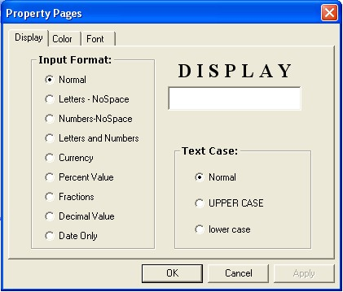



## ETextBox Activex Control

### Description

Advanced TextBox Control with Multiple Format/Text Type Selection. Like Normal, Letters, Numbers, Letters &amp; Numbers, Money, Date, Decimal and Fractions etc.
 
### More Info
 

             |
---                |---
**Submitted On**   |2005-07-25 12:09:56
**By**             |[Sajjad Ahmad](https://github.com/Planet-Source-Code/PSCIndex/blob/master/ByAuthor/sajjad-ahmad.md)
**Level**          |Advanced
**User Rating**    |4.7 (14 globes from 3 users)
**Compatibility**  |VB 6\.0
**Category**       |[OLE/ COM/ DCOM/ Active\-X](https://github.com/Planet-Source-Code/PSCIndex/blob/master/ByCategory/ole-com-dcom-active-x__1-29.md)
**World**          |[Visual Basic](https://github.com/Planet-Source-Code/PSCIndex/blob/master/ByWorld/visual-basic.md)
**Archive File**   |[ETextBox\_A1917547262005\.zip](https://github.com/Planet-Source-Code/sajjad-ahmad-etextbox-activex-control__1-61908/archive/master.zip)

### API Declarations

nothing--

